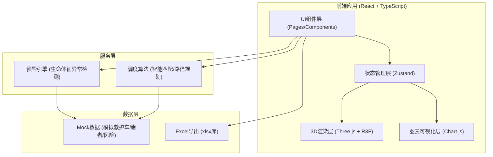
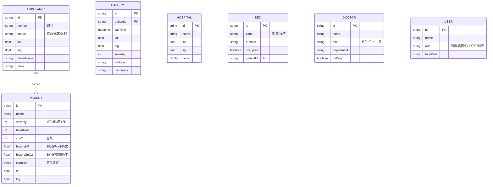

## 1. 架构设计



## 2. 技术描述
- **前端框架**: React@18 + TypeScript@5 + Vite@6
- **3D渲染**: three@0.160 + @react-three/fiber@8 + @react-three/drei@9 + @react-three/postprocessing@2
- **状态管理**: zustand@4
- **路由**: react-router-dom@6
- **样式**: tailwindcss@3 + postcss
- **图表**: chart.js@4 + react-chartjs-2@5
- **Excel导出**: xlsx@0.18
- **图标**: lucide-react@0.400
- **后端**: 无（纯前端Mock数据模拟）

## 3. 路由定义
| 路由 | 页面 | 用途 |
|------|------|------|
| /login | Login | 人脸识别登录 |
| /dashboard | Dashboard | 3D指挥大屏（主页面） |
| /emergency | Emergency | 急诊科管理 |
| /batch | BatchDispatch | 批量调度 |
| /reports | Reports | 统计报表与导出 |

## 4. 数据模型

### 4.1 数据模型定义



### 4.2 TypeScript类型定义

```typescript
type SeverityLevel = 1 | 2 | 3 | 4; // 红=1, 黄=2, 蓝=3, 绿=4
type AmbulanceStatus = 'standby' | 'dispatch' | 'return';
type UserRole = 'dispatcher' | 'doctor' | 'director' | 'commission';
type BedZone = 'red' | 'yellow' | 'green';

interface Position { lat: number; lng: number; }

interface Ambulance {
  id: string;
  number: string;
  status: AmbulanceStatus;
  position: Position;
  targetPosition?: Position;
  patient?: Patient;
  driver: string;
  crew: string[];
  route?: Position[];
}

interface Patient {
  id: string;
  name: string;
  severity: SeverityLevel;
  heartRate: number;
  spo2: number;
  historyHR: number[];
  historySpO2: number[];
  condition: string;
  position: Position;
}

interface Call120 {
  id: string;
  patientName: string;
  callTime: Date;
  position: Position;
  severity: SeverityLevel;
  address: string;
  description: string;
  status: 'pending' | 'assigned' | 'enroute' | 'arrived';
}

interface Hospital {
  id: string;
  name: string;
  position: Position;
  beds: Bed[];
}

interface Bed {
  id: string;
  zone: BedZone;
  number: string;
  occupied: boolean;
  patientId?: string;
}

interface DailyStats {
  totalCalls: number;
  avgResponseTime: number;
  outcomeStats: { recovered: number; transferred: number; deceased: number; };
}
```

## 5. 状态管理 (Zustand Store)

```typescript
// src/store/useEmergencyStore.ts
interface EmergencyState {
  ambulances: Ambulance[];
  calls: Call120[];
  patients: Patient[];
  hospitals: Hospital[];
  selectedAmbulanceId: string | null;
  userRole: UserRole | null;
  userName: string | null;
  // actions
  setSelectedAmbulance: (id: string | null) => void;
  assignAmbulance: (callId: string, ambulanceId: string) => void;
  login: (role: UserRole, name: string) => void;
  logout: () => void;
  acknowledgeBed: (bedId: string, level: number) => void;
  triggerBatchDispatch: (event: MassCasualtyEvent) => void;
}
```

## 6. 核心算法说明

### 6.1 智能匹配算法
- 计算每辆待命救护车到患者位置的球面距离（Haversine公式）
- 综合评分 = 距离权重(0.6) + 车辆状态(0.2) + 历史响应时间(0.2)
- 病情严重等级优先：红色→匹配最近3公里内车辆，黄色→5公里

### 6.2 路径规划
- 预定义城市道路节点图
- 使用A*算法计算最短路径
- 路径点贝塞尔曲线平滑处理
- 批量调度时检测路径冲突并自动避让（时间偏移+路线重规划）

### 6.3 预警引擎
- 心率正常范围：60-100 bpm，超出±20%触发预警
- SpO2正常范围：95-100%，低于90%触发红色预警
- 连续3个采样周期异常确认后推送告警
