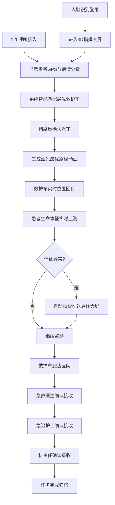
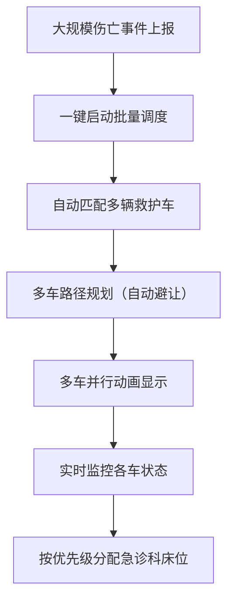

## 1. 产品概述
3D智慧急救调度与院前急救可视化平台，整合城市急救资源，实现120呼叫智能调度、救护车实时监控、院前急救可视化、急诊科床位管理、生命体征预警及大规模伤亡事件批量调度等核心功能。
- 面向急救中心调度员、急诊科医生、科主任及卫健委管理人员的专业急救指挥平台
- 提升急救响应效率、降低院前死亡率、实现急救全流程可视化追溯

## 2. 核心功能

### 2.1 用户角色
| 角色 | 登录方式 | 核心权限 |
|------|----------|----------|
| 调度员 | 人脸识别 | 调度操作、呼叫处理、车辆监控、导出报表 |
| 医生 | 人脸识别 | 查看患者信息、生命体征、接收确认、床位分配 |
| 主任 | 人脸识别 | 批量调度启动、三级确认、排班管理、统计查看 |
| 卫健委 | 人脸识别 | 全局数据查看、统计报表、监管审计 |

### 2.2 功能模块
1. **登录页面**：人脸识别登录、角色选择
2. **3D指挥大屏**：城市3D地图、急救中心、救护车、医院急诊科可视化
3. **急救调度模块**：120呼叫接入、智能匹配救护车、最优路线生成、路径动画
4. **救护车监控模块**：车辆状态显示、患者生命体征实时监测、30分钟趋势曲线
5. **生命体征预警模块**：心率血氧异常检测、自动预警推送、急诊大屏告警
6. **急诊科管理模块**：3D分区床位显示、医生排班、病情自动分区分配
7. **三级确认模块**：急救医生-急诊护士-科主任到院接收确认流程
8. **批量调度模块**：大规模伤亡事件一键启动、多车路径自动避让动画
9. **统计报表模块**：日统计Excel导出（出车量、平均响应时间、转归统计）

### 2.3 页面详情
| 页面名称 | 模块名称 | 功能描述 |
|----------|----------|----------|
| 登录页 | 人脸识别登录 | 摄像头捕获、人脸比对、角色识别、登录认证 |
| 指挥大屏 | 3D城市地图 | Three.js渲染城市建筑、道路、急救中心、医院、救护车模型 |
| 指挥大屏 | 车辆信息面板 | 显示救护车编号、状态（待命/出车/返程）、患者病情、生命体征 |
| 指挥大屏 | 趋势曲线图表 | 点击救护车展示近30分钟心率、血氧趋势曲线（Chart.js） |
| 指挥大屏 | 呼叫处理面板 | 120呼叫列表、患者GPS位置、病情分级（红黄蓝绿） |
| 指挥大屏 | 路径动画 | 蓝色轨迹路线动画、车辆行驶位置实时更新 |
| 指挥大屏 | 预警通知 | 生命体征异常弹窗告警、声音提示、急诊大屏推送 |
| 急诊科页面 | 3D分区床位 | 红黄绿三区3D床位模型、占用状态、患者信息 |
| 急诊科页面 | 医生排班 | 当日排班表、医生状态、联系方式 |
| 急诊科页面 | 三级确认流程 | 三级签字确认UI、时间戳记录 |
| 批量调度页 | 事件管理 | 事件创建、伤亡人数、位置标记 |
| 批量调度页 | 多车调度 | 多车路径规划、自动避让、实时动画 |
| 统计报表页 | 数据统计 | 出车量统计、响应时间统计、转归分类统计 |
| 统计报表页 | Excel导出 | 一键导出日统计报表Excel文件 |

## 3. 核心流程

### 3.1 急救调度主流程
用户登录系统 → 120呼叫接入 → 显示患者位置与病情 → 系统智能匹配最近可用救护车 → 调度员确认派车 → 蓝色路径动画生成 → 救护车实时位置回传 → 患者生命体征监测 → 异常自动预警 → 到达急诊科 → 三级接收确认 → 任务完成归档

### 3.2 批量调度流程

## 4. 用户界面设计

### 4.1 设计风格
- **主色调**：深空蓝(#0a1628)作为背景主色，医疗红(#e53935)、急救黄(#fdd835)、安全绿(#43a047)、冷静蓝(#1e88e5)作为四级病情标识色
- **辅助色**：科技蓝(#00e5ff)作为路径动画和高亮色
- **按钮风格**：圆角直角混合、发光边框、悬停微动效
- **字体**：标题使用Orbitron（科技感），正文使用Noto Sans SC（中文易读性）
- **布局风格**：大屏全景布局，3D场景居中，信息面板悬浮四周，数据卡片玻璃拟态效果
- **图标风格**：Lucide React线性图标，搭配发光效果

### 4.2 页面设计概述
| 页面名称 | 模块名称 | UI元素 |
|----------|----------|----------|
| 登录页 | 人脸识别 | 圆形摄像头取景框、扫描线动画、人脸轮廓引导、角色选择卡片 |
| 指挥大屏 | 3D场景 | 暗色城市夜景、发光建筑、救护车发光标识、流动路径光带 |
| 指挥大屏 | 左侧面板 | 120呼叫列表卡片、病情分级色条、GPS坐标显示 |
| 指挥大屏 | 右侧面板 | 救护车状态卡片、生命体征环形进度条、波形小图 |
| 指挥大屏 | 底部面板 | 日统计数据、预警列表、快捷操作按钮 |
| 指挥大屏 | 弹窗 | 30分钟趋势曲线图（双Y轴）、患者详细信息 |
| 急诊科 | 3D分区 | 红色抢救区、黄色观察区、绿色诊疗区立体床位模型 |
| 急诊科 | 排班表 | 时间轴样式、医生头像、状态徽章 |
| 统计报表 | 图表 | 柱状图(出车量)、折线图(响应时间)、饼图(转归) |

### 4.3 响应式
- 桌面端优先设计（1920×1080及以上大屏适配）
- 支持1280×720及以上分辨率自适应
- 触控屏操作优化（按钮尺寸、手势缩放3D场景）

### 4.4 3D场景指导
- **环境**：夜景城市，深蓝渐变天空，HDR环境光模拟城市灯光
- **光照**：环境光+方向光模拟月光，救护车和医院建筑使用自发光材质
- **相机**：透视相机，默认45°俯视角度，支持鼠标拖拽旋转、滚轮缩放
- **动画**：救护车沿路径移动（贝塞尔曲线插值）、路径流光效果、警灯闪烁、生命体征波形动画
- **后期处理**：Bloom泛光效果、轻微色差、暗角，增强科技感
- **性能**：建筑使用InstancedMesh批量渲染，救护车模型控制在5000面以内
